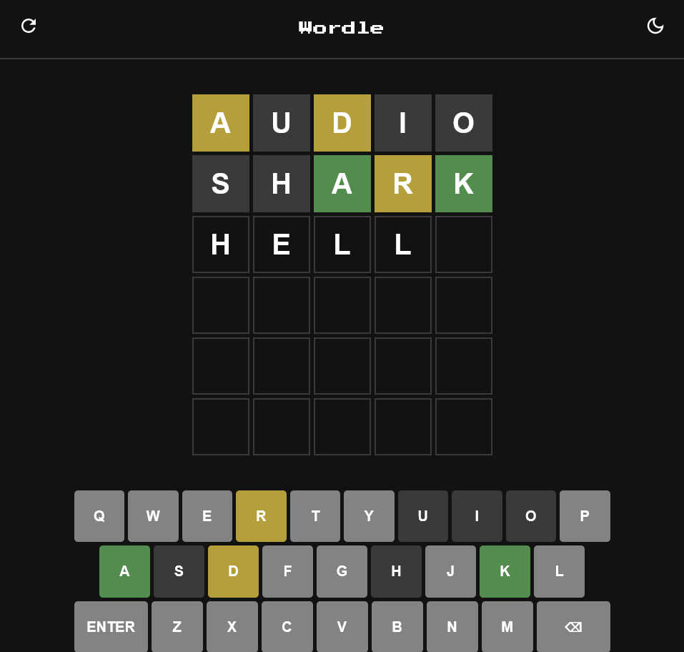

# Wordle

Trang web chơi trò chơi đoán từ tương tự như [Wordle](https://www.nytimes.com/games/wordle/index.html). *Đây là đồ án báo cáo cho môn học Internet & Công nghệ Web của nhóm sinh viên trường Đại học Công nghệ Thông tin - ĐHQG TP.HCM.*

## Chức năng

- Fetch dữ liệu từ file json để **tạo từ khoá** và phục vụ việc **kiểm tra ngữ nghĩa** của từ
- Cho phép người dùng **nhập hoặc xoá vào một từ từ bàn phím** trên trang web hoặc bàn phím thực và hiển thị lên màn hình
- **Kiểm tra vị trí** từng chữ cái của từ mà người dùng đã nhập với từ khóa cần tìm, và **cập nhập màu sắc** lên màn hình
- Hiển thị **cửa sổ thông báo** khi kết thúc vòng chơi
- **Lưu tiến trình** chơi tai Local Storage
- **Thay đổi giao diện** sáng/tối

## Giao diện

## Demo

- Source code: <https://github.com/minhlong149/wordle>
- Live demo: <https://minhlong149.github.io/wordle>

## Tham khảo

- [Web Dev Simplified](https://github.com/WebDevSimplified/wordle-clone)
- [Ania Kubów](https://github.com/kubowania/wordle-javascript)
- [Coder Coderr](https://github.com/thecodercoder/wordle-clone)

## Tác giả

- [Phạm Quang Khải](https://github.com/pqk662002)
- [Nguyễn Đào Minh Long](https://github.com/minhlong149)
- [Trần Trọng Nguyên](https://github.com/Norman-Tran)
- [Quách Kiều Oanh](https://github.com/Qanh195)
- [Chu Tấn Phong](https://github.com/phongchu21)
- [Mai Ngọc Bích](https://github.com/bichmn)
- [Lê Nguyễn Bá Duy](https://github.com/ZuyLeLe)
